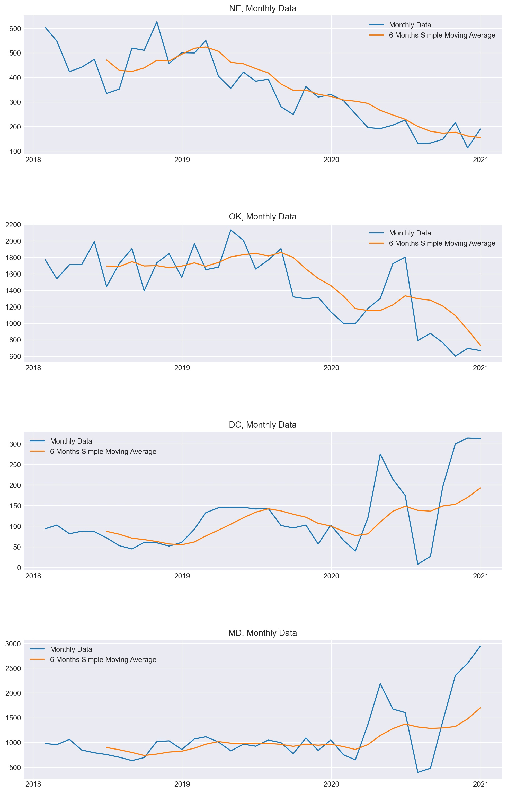

# U.S. Car Accidents per State Time Series

## Car Accidents

 

It is fair to say that accidents on the road are a major problem in urban areas.  Traffic congentions in rush hour are often made worse by an accident on the road.  The real problem is that the injuries caused by car accidents are a major problem in the healthcare industry because the truth is that [road traffic creasshes are a leading couse of death in the United States for people 1 - 54](https://www.cdc.gov/injury/features/global-road-safety/index.html).  The covid-19 pandemic may have affcted the number of accidents due to the various stay at home policies adapted per state.  This project will seek to forecast the number of accidents per state for the first quarter of 2021.

## 1. The [Data](https://www.kaggle.com/sobhanmoosavi/us-accidents)

The dataset was found in [kaggle](https://www.kaggle.com/sobhanmoosavi/us-accidents) and it contains over 4 million data on accidents in the U.S. from 2016 to 2020.  Each row of the dataset reffers to a speciffic accident.  Due to the simplistic nature of this project, the only parts of this dataset that I will use are the state in which the accident happened and the time it claims the accident happened.

## 2. Methodology

Since this project seeks to forecast the first quarter of 2021, I do not need some of the specific information that is present in the dataset.  The things I took into consideration was:

1. The data contained a robust amount of information for each individual accident record.

2. Though the plan is forecast a quarter, having the amount of accidents per day would be precise enough to understand what happens in a monthly or quarterly sampling.

3. The location information in the dataset is quite rich in precision.  My plan is to simplify that to a state only data.

## 3. [Data Wrangling & Exploratory Data Analysis](https://github.com/soccershowman/Springboard/blob/master/Capstone_3/us_accidents_data_wranggling_and_eda.ipynb)

As I mentioned before, the intent of the project is to build a simple model that will be able to forecast the number of accidents per state for the first quarter of 2021.  To accomplish that goal, I initiated the project by simply getting the 'State' and 'Start_Time' from the original dataset, the 'Start_Time' column was changed to a datetime type and its name was changed to 'Date' to inply the fact that the precision needed was a daily amount.  I then created a new columns named count and gave it a value of 1 for each row.  This new column will aid in counting the total daily accidents.  The next step was to make the 'Date' column into the index and pivot the dataset making the States the new columns and the count the value.  Doing that helped when it came time to resample the data to become daily data, which automatically summed up the amount of accidents that happened in each state per day.  Now the data is ready to be used for the project.

The next part was to check on the data for the first time so a simple plot was done and it looked as follows:

 

The plot illustrates that in some states the data may not have some deficiencies in 2016 and 2017 due to extreme low counts of accidents on parts or all of that priod.  To ensure a good quality model, I decided to only use the data from 2018 and beyond.  After plotting that here is how it looked:

 

The next step in the exploratory data analysis was to check for seasonality and trends whithin the dataset.  To do that, I resampled the data by month and plotted accordingly.  Below is a sample of plots that may show some of of those traits.

 

A slight seasonality can be noticed in some states due to the fact that the minimum value seems to happen in the middle of the year, summer time, for some cases, while the maximum value seems to be towards the end/beginning of the year.  However this seasonality is not very clear so it helps picking a simple type of model in which to fit the dataset.  In the other hand, the trend does seem to be more accentuated in some cases.  The states that demonstrate trends do not necessarily demonstrate the same trend, in other words, some states have a growing number of accidents trend and some have a trend of decreasing number of accidents.

Lastly, in the the last part of the exploratory data analysis I seeked to understand how the numbers from each year's first quarter changed.  In order to do that I got the percent change from the first quarter of each year by comparing it to the previous year, and created bar plots a geospatial plots.  They look as follows:

 

And:

 

From those plots I could see that in 2019 the rate of accidents increase and decrease was varied amongst the states.  In 2020 though, I did notice that most states had their amount of accidents decrease, so could this be a trend for 2021 or would that be the reason the percent change of 2021 will mostly increase in each individual state?

## 4. [Machine Learning](https://github.com/soccershowman/Springboard/blob/master/Capstone_3/us_accidents_machine_learning.ipynb)

### The Model

Selecting the model to use was an easy task because the intension was to have a simple forecasting model to analyse and see what could be expected for the first uarter of 2021.  The chosen model then was an AutoRegressive Integrated Moving Average (ARIMA) model.  The AutoRegression part of the model relies on past periods numbers to predict the present period by trying to detect a linear correlation between the current data with earlier data.  The Moving Average works similarly to the AR section, except that instead of relying on the value of the variable, the MA model relies on the value of the residual.  Because they have that one difference, they require different amount of lags to be able to function to the best of their ability.  The i lag will simply find a lag that is best to Integrate both models to become one complete model, if I is zero, the model then become an ARMA model.

For this project I decided to build a model for each state and save them into a single dictionary with the state's name as the key.  I then created different dictionaries for the order, model and results.  The forecast became a dataframe on its own.

### The Result

The result of the forecast is as shown in the picture below:

